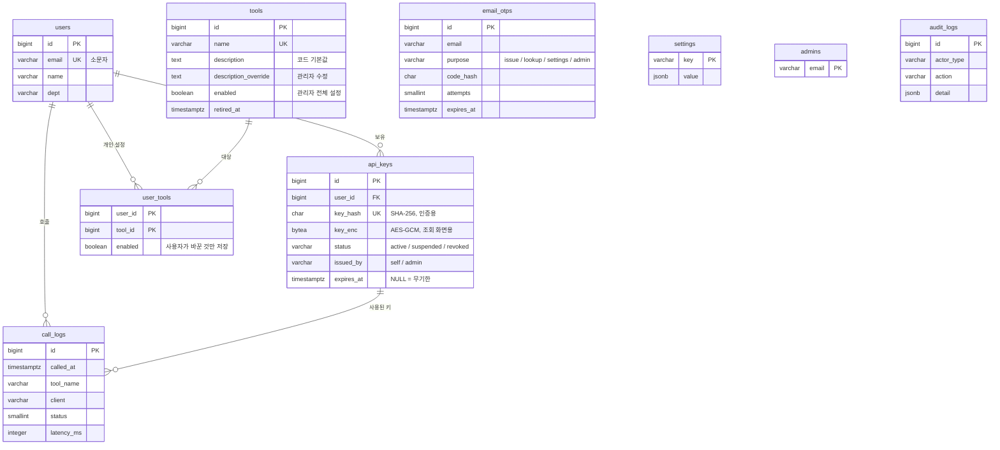

# 02. 데이터베이스 설계

- DB: PostgreSQL 14 이상
- DDL: [`sql/ddl/001_init.sql`](../sql/ddl/001_init.sql)
- 기본 설정값: [`sql/seed/001_default_settings.sql`](../sql/seed/001_default_settings.sql)

## ERD

## 테이블 요약

| 테이블 | 용도 | 화면 |
|---|---|---|
| `users` | 사용자 (이메일 인증을 처음 통과할 때 생성) | 관리자 > API 키 |
| `admins` | 관리자 이메일 목록 | 관리자 > 설정 > 관리자 |
| `api_keys` | API 키. 재발급 시 기존 키는 `revoked`, 새 행 추가 | 사용자 키 발급/조회, 관리자 > API 키 |
| `email_otps` | 인증번호. 용도(`purpose`)만 다르고 한 테이블 공용 | 이메일 → 인증번호 단계 |
| `tools` | MCP 도구 + 관리자 켜기/끄기 | 관리자 > MCP 도구 |
| `user_tools` | 사용자 개인 켜기/끄기 | 사용자 > 도구 설정 (예정) |
| `settings` | 전역 설정 key-value | 관리자 > 설정 |
| `call_logs` | 도구 호출 기록 | 관리자 > 대시보드, 사용 로그 |
| `audit_logs` | 관리자 작업, 설정 변경 기록 | 관리자 > 대시보드 > 최근 활동 |
| `v_user_tools` (뷰) | 사용자별 최종 사용 가능 여부 | MCP `tools/list` 응답 |

## 설계 결정

### API 키 저장: 해시 + 암호문 둘 다 보관
- MCP 요청이 올 때마다 키로 사용자를 찾아야 함 → `key_hash`(SHA-256)로 조회.
- 사용자 화면의 "내 키 조회"에서 원문을 다시 보여줌 → `key_enc`(AES-256-GCM)로 보관, 암호화 키는 환경변수.
- 만약 "키는 발급할 때 한 번만 보여주고 잊어버리면 재발급" 정책으로 바꾸면 `key_enc`를 빼면 됨 (보안상 더 안전).

### 사용자당 살아있는 키는 1개
- 부분 유니크 인덱스 `uq_api_keys_live_per_user`(status ≠ revoked)로 DB가 강제.
- 재발급 = 기존 키 `revoked` + `revoked_at` 기록 → 새 키 INSERT (같은 트랜잭션).
- 폐기된 키도 행을 남겨서 과거 호출 기록(`call_logs.api_key_id`)과 연결 유지.

### 도구는 코드가 원본, DB는 운영 설정
- 도구 추가·삭제는 코드로 함. 서버 시작 시 코드의 도구 목록을 `tools`에 `name` 기준으로 upsert.
- 코드에서 빠진 도구는 삭제하지 않고 `retired_at` 기록 (호출 기록 보존).
- 관리자는 `enabled`, `description_override`만 바꿈.

### 사용자 도구 설정은 바꾼 것만 저장
- `user_tools`에 행이 없으면 켜짐(기본값). 사용자가 끄거나 다시 켤 때만 행이 생김.
- 규칙은 [04-tool-policy.md](04-tool-policy.md) 참고.

### 이메일은 소문자로 정규화
- 대소문자만 다른 이메일이 다른 사용자로 생기지 않도록 CHECK 제약(`email = lower(email)`)으로 강제. 앱에서 저장 전에 `lower()`.

### 호출 기록 보관
- 기본 365일 보관 (`settings.log_retention_days`), 매일 배치로 오래된 행 삭제.
- 데이터가 많아지면 `call_logs`를 월별 파티션으로 전환.

### DB에 넣지 않는 것
- **분당 호출 제한 카운터**: 매 요청마다 갱신돼서 DB에 부담 → 앱 메모리(서버 1대일 때) 또는 Redis.
- **세션**: 서명된 토큰(JWT)으로 처리해서 테이블 불필요. [03-auth.md](03-auth.md) 참고.
