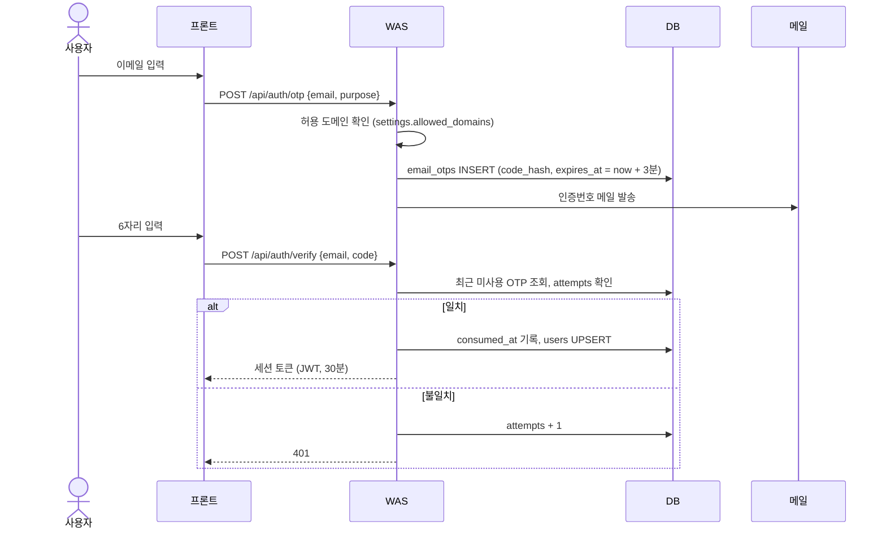

# 03. 인증 흐름

인증은 두 종류다.

| 구분 | 누가 | 방법 |
|---|---|---|
| 웹 화면 인증 | 사용자·관리자 (브라우저) | 이메일 인증번호 → 30분 세션 |
| MCP 인증 | Claude Code 등 클라이언트 | `Authorization: Bearer <API 키>` |

## 1. 이메일 인증번호 → 세션



### 규칙
- 인증번호 유효 시간: 3분 (`settings.otp_ttl_minutes`)
- 최대 시도: 5회 (`settings.otp_max_attempts`). 초과 시 그 번호는 무효, 새로 받아야 함.
- 재발송: 같은 이메일은 30초에 1번, 1시간에 10번까지 (메일 폭탄 방지).
- 허용 도메인(`settings.allowed_domains`)이 아닌 이메일은 바로 거절 ("회사 이메일만 사용할 수 있어요").
- 번호는 원문 저장 안 함: `HMAC-SHA256(OTP_PEPPER, code)`로 저장.

### 세션
- 인증 성공 시 JWT(HS256, `SESSION_SECRET`) 발급, 유효 시간 30분 (`settings.session_ttl_minutes`).
- 세션 동안은 키 조회, 재발급, 도구 설정을 인증번호 없이 할 수 있음.
- 쿠키는 사용자용 `smcp_user`, 관리자용 `smcp_admin`으로 따로 (한쪽 로그인이 다른 쪽을 덮어쓰지 않게). `HttpOnly`, `SameSite=Lax`, 운영에서는 `Secure`.
- 관리자 로그인은 `purpose = 'admin'`으로 인증하고, `admins` 테이블에 있는 이메일만 통과. 관리자 API는 요청마다 `admins`를 다시 확인해서 관리자에서 빠지면 즉시 차단.
- "처음으로"를 누르면 사용자 세션을 지움.

### 메일 발송 (미구현)
- 지금은 `server/src/lib/mailer.ts`의 `ConsoleMailer`가 메일 대신 **서버 로그에 인증번호를 출력**함.
- 개발 중에는 `OTP_DEV_ACCEPT_ANY=true`로 아무 6자리나 통과시킬 수 있음. `NODE_ENV=production`에서 이 값이 true면 서버가 시작을 거부함.
- 메일 정보를 받으면 `Mailer` 구현만 바꾸면 됨 → [06-setup.md](06-setup.md#메일-연동).

## 2. MCP 요청 인증

```
Claude Code ──(Authorization: Bearer selim_mcp_xxx)──→ /mcp
```

1. 헤더의 키를 SHA-256 → `api_keys.key_hash`로 조회
2. 확인 순서 → 실패 시 응답

| 확인 | 실패 시 |
|---|---|
| 키가 존재 | 401 |
| `status = 'active'` | 401 (정지·폐기) |
| `expires_at`이 없거나 미래 | 401 (만료) |
| 분당 호출 제한 이내 | 429 |
| 도구가 사용 가능 (`v_user_tools.effective_enabled`) | 403 |

3. 도구 호출(`tools/call`)은 성공·실패 모두 `call_logs`에 기록. `api_keys.last_used_at`은 1분에 한 번만 갱신.
4. 클라이언트 종류(Claude Code / Desktop / Cursor)는 User-Agent로 추정.

## 화면별 인증 정리

| 화면 | 인증 |
|---|---|
| 키 발급 / 내 키 조회 | 이메일 인증번호 → 세션 |
| 내 도구 설정 | 같은 세션 |
| 관리자 페이지 | 이메일 인증번호(`admin`) → 관리자 세션 |
| MCP 사용 | API 키 |
